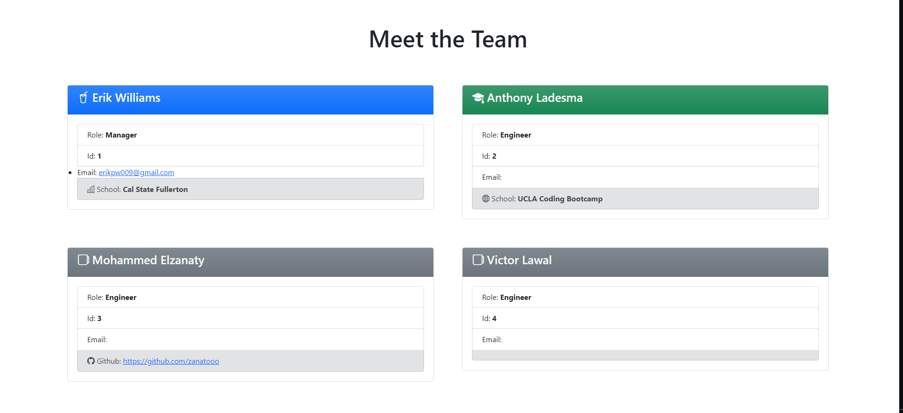
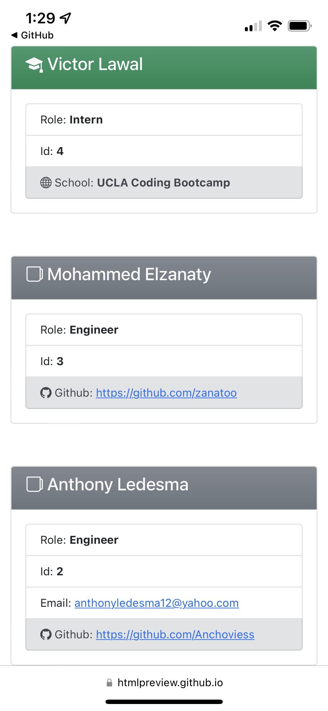
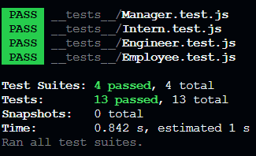

# Team Profile Generator

This Node.js command-line application collects information about employees on a software engineering team and generates an HTML webpage that displays summaries for each person. To ensure the maintainability of the code, unit tests have been written for every part of the application to confirm that it operates without errors.

## Application structure

```
.
├── __tests__/             //jest tests
│   ├── Employee.test.js
│   ├── Engineer.test.js
│   ├── Intern.test.js
│   └── Manager.test.js
├── dist/                  // rendered output (HTML)
│   ├── index.html
├── lib/                   // classes
│   ├── Employee.js
│   ├── Engineer.js
│   ├── Intern.js
│   └── Manager.js
├── .gitignore             // indicates which folders and files Git should ignore
├── index.js               // runs the application
└── package.json
```

## Application classes

The application includes `Employee`, `Manager`, `Engineer`, and `Intern` classes. The tests for these classes (in the `_tests_` directory) ALL pass.

The first class is an `Employee` parent class with the following properties and methods:

- `name`

- `id`

- `email`

- `getName()`

- `getId()`

- `getEmail()`

- `getRole()`&mdash;returns `'Employee'`

The other three classes extend `Employee`.

In addition to `Employee`'s properties and methods, `Manager` also have the following:

- `officeNumber`

- `getRole()`&mdash;overridden to return `'Manager'`

In addition to `Employee`'s properties and methods, `Engineer` also have the following:

- `github`&mdash;GitHub username

- `getGithub()`

- `getRole()`&mdash;overridden to return `'Engineer'`

In addition to `Employee`'s properties and methods, `Intern` also have the following:

- `school`

- `getSchool()`

- `getRole()`&mdash;overridden to return `'Intern'`

## Screenshots of generated HTML

The following image shows the generated HTML’s appearance.

### Desktop screenshot



### Responsive mobile screenshot



## Starting the application

This application uses [Inquirer](https://www.npmjs.com/package/inquirer) for collecting input from the user. The application will be invoked by using the following command:

```bash
node index.js
```

## Running tests

This application uses [Jest](https://www.npmjs.com/package/jest) for running the unit tests. The application's tests will be invoked by using the following command:

```bash
npm test
```



### Entries used

```
.
├── Manager
   ├── Erik Williams
   ├── 1
   ├── erikpw009@gmail.com@
   ├── Cal State Fullerton
├── Engineer
   ├── Anthony Ladesma
   ├── 2
   ├── anthony.ladesma@fakemail.com
   ├── UCLA Coding Bootcamp
├── Engineer
   ├── Mohammed Elzanaty
   ├── 3
   ├── mohammed.elzanaty@fakemail.com
   ├── zanatooo
├── Intern
   ├── Victor Lawal
   ├── 4
   ├── victor.lawal@fakemail.com
   ├── UCLA CODING Bootcamp

```

## Link to output HTML file

[Output HTML file](https://htmlpreview.github.io/?https://github.com/EPW80/Team-Profile-Generator/blob/main/dist/index.html)
